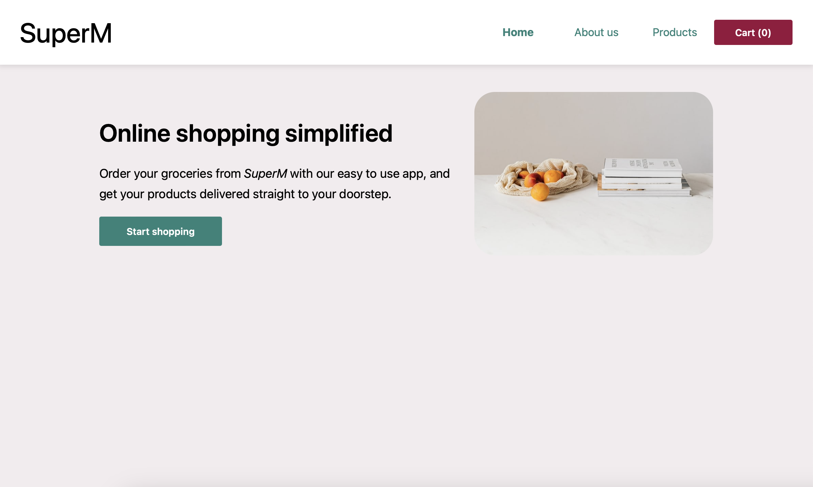
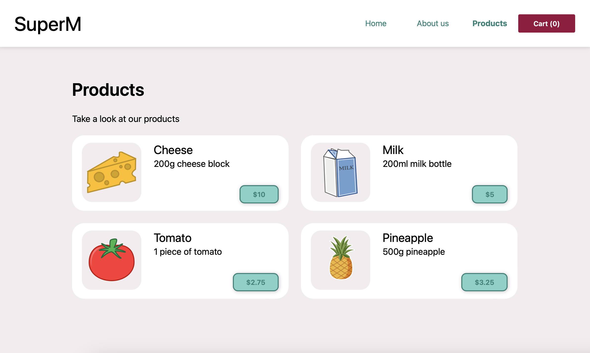
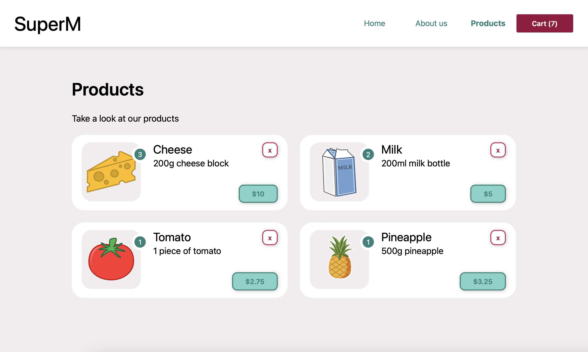
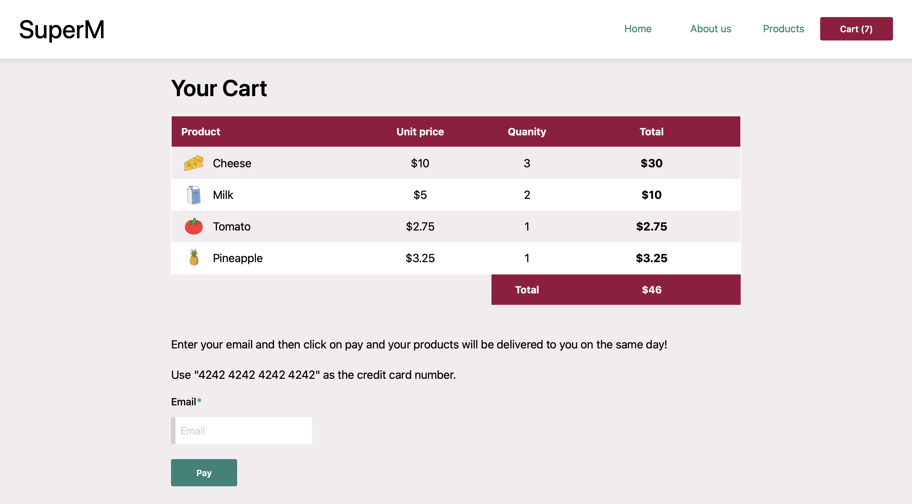
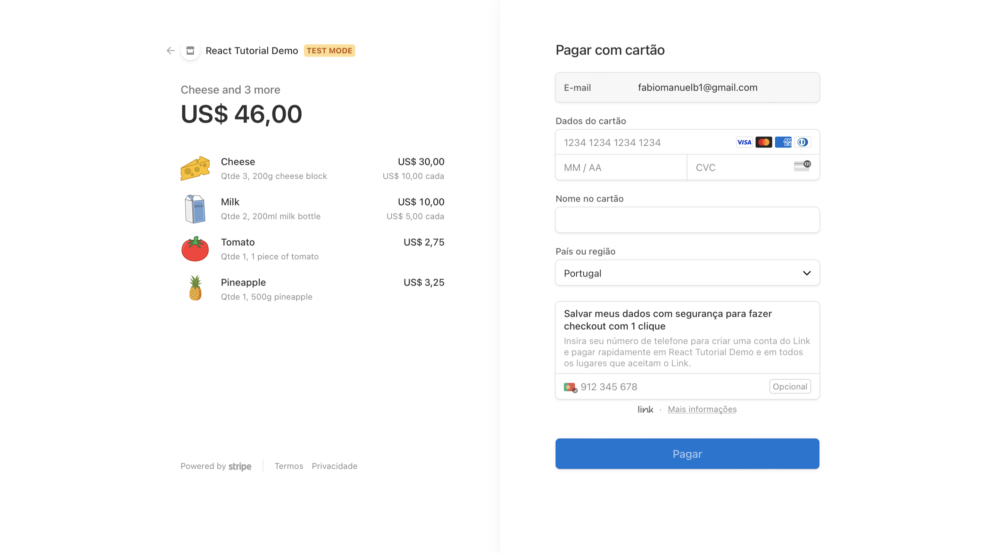
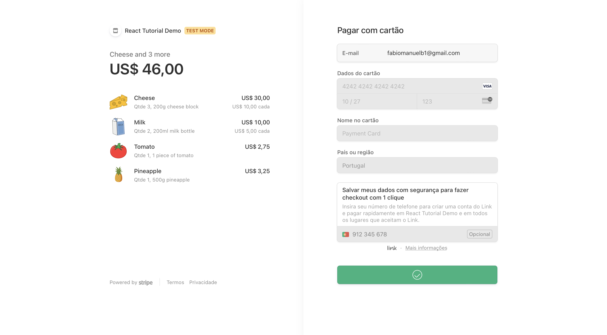

# SuperM Webstore 
[SuperM Webstore Link](https://superm-onlinestore.netlify.app) 🛒

SuperM is a webstore project made in ReactJS.

## Technologies Used

- **ReactJS**: A JavaScript library for building user interfaces.
- **Redux**: A predictable state container for JavaScript applications, commonly used with React for managing application state.
- **Vite**: A fast and lightweight build tool for modern web applications.
- **API**: Custom API endpoints for handling backend functionality.
- **Stripe Payment**: A payment processing platform for accepting online payments.

## Home Page

## Products Page

Products page with some products already selected.

## Cart Page

## Payment Page - Stripe Integration

Stripe test payment page.

After this successful payment, we are redirected to our webstore page.

## Conclusion

We're proud to say that all the technologies used in this project, including React, Redux, Vite, the API, and Stripe payment integration, work seamlessly together. They contribute to the smooth and reliable functionality of our webstore.

Feel free to fork this project, experiment, and make it your own. Your creativity and expertise can take this webstore to new heights. I encourage you to share your modifications with the community and help us create an even better webstore experience.

Thank you for your interest in the project, and I look forward to seeing your contributions. Happy coding and happy webstore editing!
